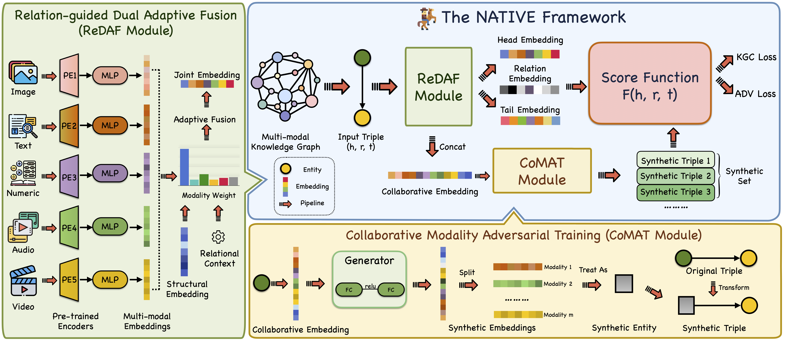

# NativE: Multi-modal Knowledge Graph Completion in the Wild

[](https://github.com/zjukg/NATIVE/main/LICENSE)
[](https://dl.acm.org/doi/abs/10.1145/3626772.3657800)
[](https://pytorch.org/)
[](https://sigir-2024.github.io/index.html/)
 - [NativE: Multi-modal Knowledge Graph Completion in the Wild (ACM Library)](https://dl.acm.org/doi/abs/10.1145/3626772.3657800)
 - [NativE: Multi-modal Knowledge Graph Completion in the Wild (Arxiv)](https://arxiv.org/abs/2406.17605)

> To address the diversity and imbalance issues in multi-modal knowledge graph completion, we propose a comprehensive framework NativE to achieve MMKGC in the wild. NativE proposes a relation-guided dual adaptive fusion module that enables adaptive fusion for any modalities and employs a collaborative modality adversarial training framework to augment the imbalanced modality information. We construct a new benchmark called WildKGC with five datasets to evaluate our method. The empirical results compared with 21 recent baselines confirm the superiority of our method, consistently achieving state-of-the-art performance across different datasets and various scenarios while keeping efficient and generalizable.

## Overview


## Dependencies
```bash
pip install -r requirement.txt
```

#### Details
- Python==3.8
- numpy==1.23.3
- scikit_learn==1.1.2
- torch==1.9.1
- tqdm==4.64.1
Our code is based on OpenKE, an open-source KGC project. You can refer to the [OpenKE repo](https://github.com/thunlp/OpenKE) to build the environment.

## Data Download
You should first download the pre-trained multi-modal embeddings from [Google Drive](https://drive.google.com/drive/folders/191u4WhT_7P9Ze8Q9N3U3rdr8IWEKYMry?usp=sharing) and put them in the `embeddings/` path.

## Train and Evaluation
You can refer to the training scripts in `scripts/` to reproduce our experiment results. Here is an example for DB15K dataset.

```bash
DATA=DB15K
EMB_DIM=250
NUM_BATCH=1024
MARGIN=12
LR=1e-4
LRG=1e-4
NEG_NUM=128
MU=0.0001
EPOCH=1000

CUDA_VISIBLE_DEVICES=1 nohup python run_adv_wgan_gp_3modal.py -dataset=$DATA \
  -batch_size=$NUM_BATCH \
  -margin=$MARGIN \
  -epoch=$EPOCH \
  -dim=$EMB_DIM \
  -adv_num=$ADV\
  -save=$DATA-$NUM_BATCH-$EMB_DIM-$NEG_NUM-$MU-$MARGIN-$LR-$EPOCH \
  -neg_num=$NEG_NUM \
  -mu=$MU \
  -learning_rate=$LR\
  -lrg=$LRG > $DATA-$EMB_DIM-$NUM_BATCH-$NEG_NUM-$MU-$MARGIN-$LR-$EPOCH.txt &
```

More training scripts can be found in `scripts/`.


## 🤝 Cite:
Please consider citing this paper if you use the code from our work.
Thanks a lot :)

```bigquery

@inproceedings{DBLP:conf/sigir/ZhangCGXHLZC24,
  author       = {Yichi Zhang and
                  Zhuo Chen and
                  Lingbing Guo and
                  Yajing Xu and
                  Binbin Hu and
                  Ziqi Liu and
                  Wen Zhang and
                  Huajun Chen},
  title        = {NativE: Multi-modal Knowledge Graph Completion in the Wild},
  booktitle    = {{SIGIR}},
  pages        = {91--101},
  publisher    = {{ACM}},
  year         = {2024}
}

```